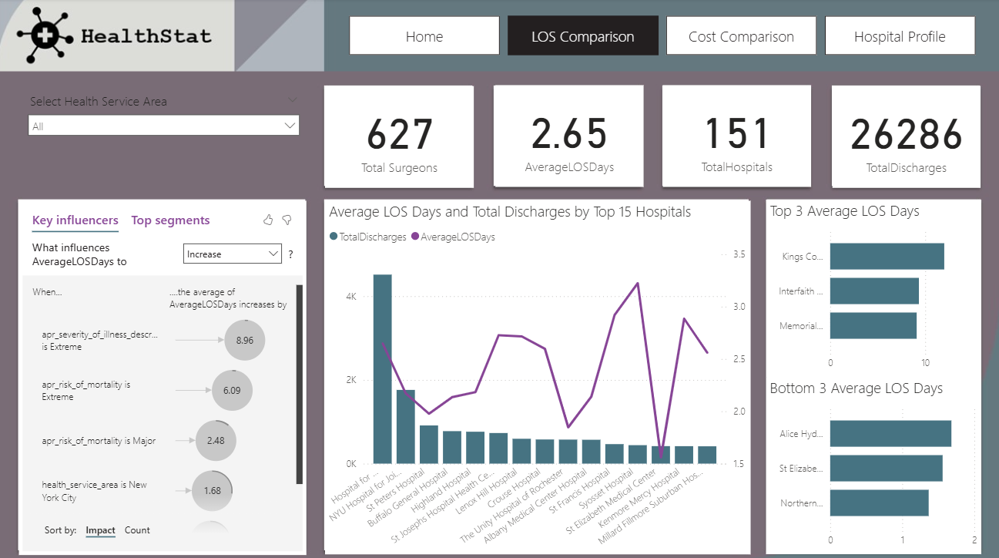
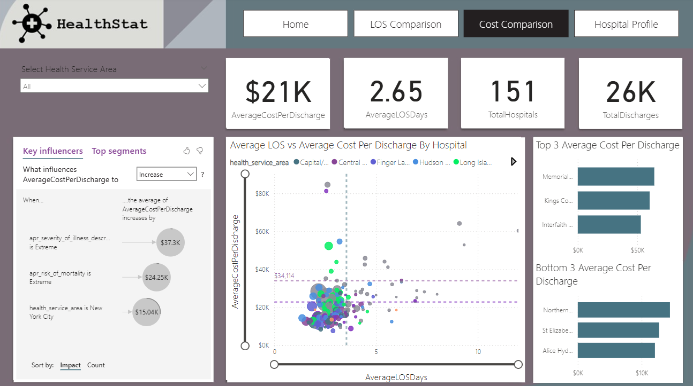
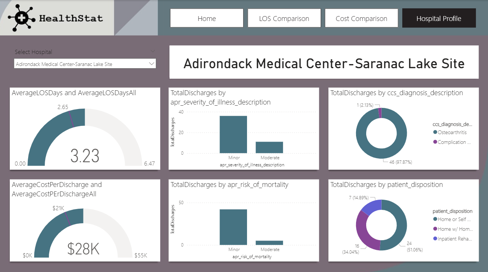

# Health_Care_Data_Analysis
Power BI dashboard for analyzing healthcare data, focusing on patient demographics, treatment outcomes, and hospital performance metrics.

## 📊 Dashboard Features

- Patient distribution by age, gender, and region
- Treatment outcome analysis
- Hospital admission and discharge trends
- Common diagnoses and medical procedures
- Resource utilization (e.g. beds, doctors, departments)
- Interactive filters and slicers

## 🧩 Dataset

The dataset includes healthcare-related data such as:
- Patient ID, age, gender, region
- Diagnosis and treatment type
- Admission/discharge dates
- Outcome status (recovered, referred, etc.)
- Hospital and department details

## 🔧 Tools Used

- Power BI Desktop
- Power Query Editor (for data preprocessing and transformation)
g, improve outcomes, and monitor key health metrics.

## 🧠 Key Insights

- Certain age groups have higher readmission or treatment failure rates.
- Resource usage varies significantly by department and season.
- Treatment outcomes are better in hospitals with shorter wait times.
